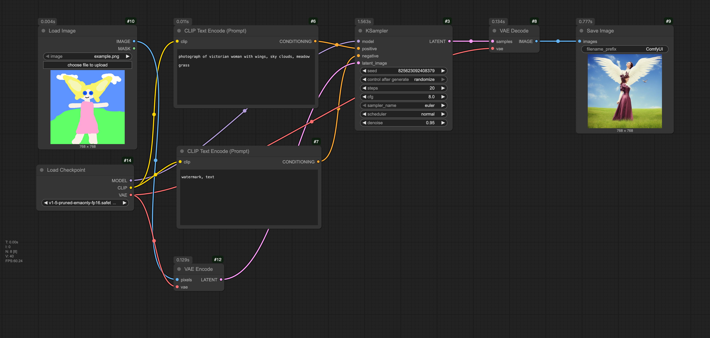

# p5-comfy-workshop

* Workshop combining p5.js and ComfyUI, via RunComfy.com
* Golan Levin, 16 October 2025 - at RISD CTC

---

## Overview

This is a workshop for combining p5.js and ComfyUI, deployed using cloud-based GPU servers at RunComfy.com. In this workshop, the canvas produced by simple generative code in p5.js is used to guide an img2img algorithm — effectively treating Stable Diffusion as a filter or renderer. The workshop is based on the [p5.comfyui-helper](https://github.com/gohai/p5.comfyui-helper) by [Gottfried Haider](https://github.com/gohai) *(thanks to @gohai for a great resource!)*, the [comfyui-p5js-node](https://github.com/tracerstar/comfyui-p5js-node) by Benjamin Fox, and invaluable help from CMU BCSA student, [Lorie Chen](https://github.com/ylchen333/p5.comfyui-helper/tree/main?tab=readme-ov-file). For related work, see also my [p5-in-comfyui](https://github.com/golanlevin/p5-in-comfyui), [image analysis](https://github.com/golanlevin/60-212/tree/main/lectures/comfy/image_analysis), and [image synthesis](https://github.com/golanlevin/60-212/tree/main/lectures/comfy/image_synthesis) lessons. This workshop was initially prepared for a presentation to undergraduates in RISD's Computation, Technology, and Culture (CTC) program in October, 2025. 

---

## ComfyUI Setup 

These are instructions for configuring [RunComfy.com](https://www.runcomfy.com/) to provide stable-diffusion image synthesis for the provided [p5.js sketch example](https://editor.p5js.org/golan/sketches/hDteUa1V_). The typical expectation is that these instructions would be followed by a workshop leader. Click "Details" for more information. 

* **Make** an account at RunComfy.com if you don't already have one. The free "Hobby" trial offers a few credits, but you will likely need to **load** up your account with a few bucks to get real work done. 
* **Go** to [https://www.runcomfy.com/comfyui-workflows](https://www.runcomfy.com/comfyui-workflows).
* **Select** the *ComfyUI-NodesLoaded* workflow; then *Launch & Build* a Medium machine ($0.99/hour), and click *Launch*. **Hold on**; it will take 3-5 minutes to spin up a server.
* **Go** to the "**C**" menu in the upper left and select ⚙️ Settings. This will open a Settings control panel interface. 
* Under Settings→Comfy→Dev Mode, **enable** Dev Mode ("Enable dev mode options (API save, etc.)"), by turning the switch to ON (blue).
* Under Settings→Lite Graph→Node (scroll down), **set** "Node ID badge mode" to “Show All”.
* **Test** the network by clicking ▶️ Run. After a few seconds (it's loading models), it should generate a purple bottle image.
* (This isn't critical but) **Drag** [this workflow image](comfy/workflow_img2img_image.png) or [this workflow json file](comfy/workflow_img2img_api.json) into the RunComfy window. You should be able now to run the exact workflow that we will use from p5.js.
* **Copy** the URL for the active RunComfy server from your browser window. It should look something like "https://www.runcomfy.com/comfyui/94de82a2-9ac3-4147-b3f4-3652c15d7d96/servers/eae46885-0d2b-4555-9a3c-27263c7a56ab".
	* If you prefer the old-style (2024) ComfyUI interface, go to Settings→Menu - Disabled.
	* If you need to export a new workflow for the p5 sketch, be sure to save the workflow with: *Save (API Format)*.
* **Go** to the demonstration p5.js app (beetles) [at Editor](https://editor.p5js.org/golan/sketches/hDteUa1V_) or [at OpenProcessing](https://openprocessing.org/sketch/2761003). **Paste** the RunComfy server URL into the code for the variable, `const RunComfyURL = `, so that the sketch can find your server. 
* **Run** the demonstration sketch; you should see a still life of some beetles.
* Don't forget to **stop** the server once you're done, by pressing the ⏹️ stop button.

---

## Workshop

### 0. Overview - Contents

1. Quick review of p5.js
 	* As used in generative art
 	* Some basic code
2. Introduction to Stable Diffusion
	* [More like this, please](https://github.com/golanlevin/lectures/blob/master/lecture_cnns_and_gans/more-like-this-please.md)
3. Main activity
	* Use a generative design, and a generated caption, to guide a stable diffusion process — effectively treating AI like a 'render layer'. 

---

### 1. p5.js Review

* How some artists are using p5.js for generative art ("more like this please"):
  * [Forecast](https://www.fxhash.xyz/project/forecast) by [Amy Goodchild](https://www.amygoodchild.com/about)
  * [*nth culture*](https://deca.art/collection/nth-culture-by-fingacode) by [Junior Ngoma](https://www.youtube.com/watch?v=2Lero3In5uc) (Fingacode)
  * [*Memories of Qilin*](https://www.artblocks.io/collection/memories-of-qilin-by-emily-xie) by [Emily Xie](https://emilyxie.art/about)
  * [*Fragments of an Infinite Field*](https://www.artblocks.io/collection/fragments-of-an-infinite-field-by-monica-rizzolli) by [Monica Rizzolli](https://monicarizzolli.io/)
  * [*Take Wing*](https://www.fxhash.xyz/project/take-wing) by [Melissa Wiederrecht](https://melissawiederrecht.com/about)
  * [*Turner Light*](https://www.fxhash.xyz/generative/slug/turner-light) by [Aluan Wang](https://aluanwang.com/)
* Introduction to some simple code structures for generativity
  * [The problem](https://editor.p5js.org/golan/sketches/q5z3EFQ31)
  * [Generate with a very low `frameRate()`](https://editor.p5js.org/golan/sketches/xkcseJy0d)
  * [Click to Generate using `redraw()`](https://editor.p5js.org/golan/sketches/njx4cWSRf)
  * [Click to Generate using `randomSeed()`](https://editor.p5js.org/golan/sketches/HmynAX3EA)
* Review of [slider UI elements](https://editor.p5js.org/golan/sketches/f0RthyKYM)
* Review of randomness: 
 	* random numbers within a range
 	* random events with low probability.
 	* *(time permitting)* `randomGaussian()` 
* Review of [string assembly](https://editor.p5js.org/golan/sketches/PP_Emgakj)
* Review of [knowing where things are](https://editor.p5js.org/golan/sketches/JFlu4PaxE)
* **Activity**: *Generative Landscape* (30 minutes):
	* **Create** an account at the [p5.js editor](https://editor.p5js.org/), if you don't already have one.
	* In a 512x512 pixel canvas, **create** a p5.js program that generates an ***extremely extremely extremely SIMPLE*** abstract "landscape," governed by some randomness. Populate your landscape with features that are suitable for your concept: trees, buildings, vehicles, animals, people, trash, seaweed, volcanoes, craters, zombies, etc. *You don't have much time, so keep your design extremely schematic.*
	* Have your sketch generate a simple **caption** for your landscape, as well. Your sketch should generate a new landscape (and caption) each time the user clicks. If possible, have properties of your landscape be reflected in the caption.
	* **Consider**: foreground, middle-ground, and background layers; natural and human-made features; utopia, dystopia; heaven, hell; outside (exterior) scenes, vs. interior ones.
	* **Possible variation**: Populate your landscape with one or more of the “three verticals” (people, trees, and buildings): according to Jungian psychology, these are the defining psychological features of landscapes.
	* **Possible variation**: Consider the point of view: first-person (as if you were driving); train window; satellite/bird's-eye view.
	* IGNORE THIS: *(Here's a somewhat [overcomplicated example](https://editor.p5js.org/golan/sketches/Vzn7OHiwI).)*
	* Here's a basic example you could get started with: [a statue of a plinth in a park](https://editor.p5js.org/golan/sketches/0wCeQcItc). 

---

### 2. Introduction to Stable Diffusion

* [More Like This, Please](https://github.com/golanlevin/lectures/blob/master/lecture_cnns_and_gans/more-like-this-please.md) (With AI)
	* Contrasting older and newer approaches to generative art
	* Programming with examples, not instructions
* [Bare-bones Diffusion Models explanation](https://madebyoll.in/posts/dino_diffusion/) by Ollin Boer Bohan (2023)
	* *"Criteria for image generation: plausibility, proportionality, and originality"*
	* *"Image denoising solves image generation....Denoising-based generation works by iterative [pareidolia](img/pareidolia.png)."*
	* *"At each step of training, the network receives a new batch of randomly-selected noisified real images, tries its best to denoise them, checks its work against the real images, and gets a little bit better."*
* Interactive Diffusion explainer
	* [Dino-Diffusion explainer demo](https://madebyoll.in/posts/dino_diffusion/demo/) (Bohan)
	* [At openProcessing.org](https://openprocessing.org/sketch/2321795)
	* [At the editor.p5js.org](https://editor.p5js.org/golan/sketches/LeAHAOHgZ)
* **Activity**: Stable Diffusion tinkering (10-15 minutes)
	* Fiddle with the `generateInputImage()` function in the [Dino Diffusion sketch here](https://editor.p5js.org/golan/sketches/LeAHAOHgZ), seeing how you can make different graphics to guide the synthesis. (Stick to grayscale input.)

--- 

### 3. Main Activity

The instructor will launch a ComfyUI server at RunComfy.com, using the instructions from Section 1, above. *Now*, 

* We will generate an image in p5.js, along with a caption string
* We will transmit that image and string over websockets to a ComfyUI server in the cloud; 
* ComfyUI will guide a stable diffusion process using that image and text prompt, and will then return that image to p5.js. 

**The main activity:** 

* **Modify** this p5.js template (beetles) [at Editor](https://editor.p5js.org/golan/sketches/hDteUa1V_) or [at OpenProcessing](https://openprocessing.org/sketch/2761003), to **make** a landscape or still life in p5.js, which is interpreted by Stable Diffusion. 
* Press 's' to save your images and caption. 

Additional links: 

* [p5.js demo: Bugs + img2img](https://editor.p5js.org/golan/sketches/hDteUa1V_)
* [p5.js sketch: Statue + img2img](https://editor.p5js.org/golan/sketches/4Zf9cQRhS)
* [p5.js sketch: Landscape + img2img](https://editor.p5js.org/golan/sketches/mxIDsOjo0)

This is the workflow we will be running:

---

### I'd Like to Learn More

*Time permitting:* There's *lots* more to explore in ComfyUI, including the ability to [swap in different models](https://github.com/golanlevin/60-212/tree/main/lectures/comfy/image_synthesis#using-other-stable-diffusion-models)!

To learn more about ComfyUI, I recommend you **read** the following article: [Beginner's Guide to ComfyUI](https://aituts.com/comfyui/) by AITuts. This should take about 10 minutes. Feel free to browse any or all of the following optional resources too!: 

  * [ComfyUI Github](https://github.com/comfyanonymous/ComfyUI/blob/master/README.md)
  * [ComfyUI Examples](https://github.com/comfyanonymous/ComfyUI_examples)
  * [Beginner's Guide to ComfyUI](https://stable-diffusion-art.com/comfyui/)
  * [Pixaroma ComfyUI YouTube Tutorials](https://www.youtube.com/playlist?list=PL-pohOSaL8P9kLZP8tQ1K1QWdZEgwiBM0)
  * [Purz ComfyUI YouTube Channel](https://www.youtube.com/@PurzBeats)
  * [ComfyUI Reddit](https://www.reddit.com/r/comfyui/)

---